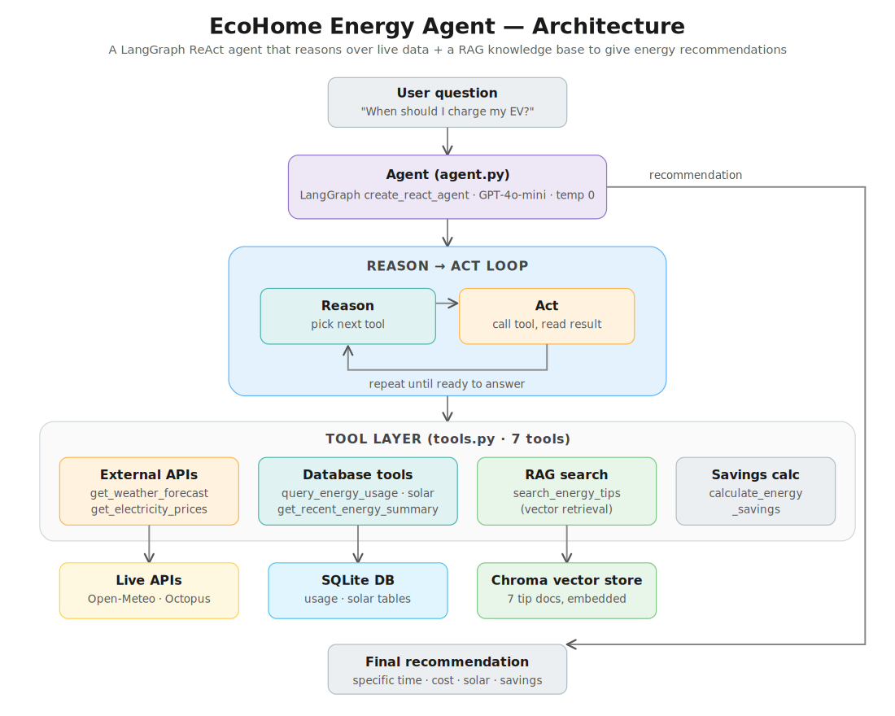

# EcoHome Experiments

Experiment code, evaluation scripts, and figure generation for the paper
**LLMs for Agentic Home Energy Management**
([arXiv:2607.04569](https://arxiv.org/abs/2607.04569) ·
[project website](https://www.ecohomeagent.com/)).

This repository contains the experiment harness and plotting scripts used to
produce the results and figures in the paper. The system under study is a
LangGraph ReAct agent that reasons over live data (weather forecasts,
time-of-use electricity prices) and a RAG knowledge base of energy-saving tips
to produce cost- and solar-aware scheduling recommendations for home devices
such as EVs, HVAC, and appliances.

> **New here?** Start with [`START_HERE.md`](START_HERE.md), then see
> [`HOW_TO_PLOT.md`](HOW_TO_PLOT.md) for regenerating figures and
> [`experiments/RUNBOOK.md`](experiments/RUNBOOK.md) for running the
> experiment pipeline.

## Architecture



A user question enters a LangGraph `create_react_agent`, which runs a
**reason → act** loop, calling one tool at a time and reading its result until
it is ready to answer. Tools span external APIs (weather, electricity prices),
database queries (energy usage, solar generation), RAG retrieval over a Chroma
vector store of tip documents, and a savings calculator. The loop terminates in
a final recommendation specifying a time, its cost, solar considerations, and
estimated savings.

## Repository layout

```
ecohome_experiments/
├── START_HERE.md              # Orientation — read this first
├── HOW_TO_PLOT.md             # How to regenerate the paper figures
├── architecture_diagram.png   # System architecture (shown above)
│
├── plot_fig_money.py          # Cost figure
├── plot_fig2_pareto.py        # Figure 2 — function-calling agent Pareto
├── plot_fig3_taxonomy.py      # Figure 3 — taxonomy
├── plot_fig4_sensitivity.py   # Figure 4 — forecast-noise sensitivity
├── plot_fig5_cumulative.py    # Figure 5 — cumulative cost over 7 days
├── exp2_results.txt           # Saved results referenced by the plots
│
├── experiments/               # Experiment engine (see experiments/RUNBOOK.md)
│   ├── config.py              # Run configuration
│   ├── runner.py              # Main experiment runner
│   ├── eval_agent.py          # Agent-response evaluation
│   ├── eval_tools.py          # Tool-usage evaluation
│   ├── eval_prompts.py        # Prompt definitions for evaluation
│   ├── scorer.py              # Scoring logic
│   ├── analyze.py             # Post-run analysis
│   ├── compute_baselines.py   # Baseline policies (heuristics, MILP references)
│   ├── optimizer.py           # MILP / optimization backend
│   ├── pv_model.py            # Solar (PV) generation model
│   ├── grids.py               # Grid / pricing grids
│   ├── mine_scenarios.py      # Scenario mining
│   ├── fetch_archives.py      # Archived deployment-day data retrieval
│   ├── archive.py             # Archive helpers
│   ├── test_runner_offline.py # Offline runner for tests
│   └── RUNBOOK.md             # Step-by-step run instructions
│
├── data/                      # Result files consumed by the plots
├── figs/                      # Generated figures (output)
├── tests/                     # Test suite
└── requirements.txt           # Pinned dependencies
```

## Figures

The `plot_*.py` scripts read result files and write publication figures to
`figs/` as both `.pdf` (for the paper) and `.png`. See
[`HOW_TO_PLOT.md`](HOW_TO_PLOT.md) for the authoritative instructions and the
exact input each script expects.

| Script | Figure |
| --- | --- |
| `plot_fig2_pareto.py` | Cost–latency–optimality Pareto for the function-calling agents (GPT-4o-mini, Gemini 2.5 Flash, Claude Sonnet 4.6). Bubble area ∝ cost per successful schedule. |
| `plot_fig3_taxonomy.py` | Taxonomy figure. |
| `plot_fig4_sensitivity.py` | Forecast-noise sensitivity of weather-aware scheduling: realized net cost vs. signed forecast error, with the price-only baseline as reference. |
| `plot_fig5_cumulative.py` | Cumulative realized net cost over 7 deployment days, one trajectory per policy (baseline heuristics, MILP references, and the LLM agents). |
| `plot_fig_money.py` | Cost figure. |

## Setup

```bash
python -m venv .venv
source .venv/bin/activate        # Windows: .venv\Scripts\activate
pip install -r requirements.txt
```

Create a `.env` file with the API keys the tools and LLM client expect:

```bash
OPENAI_API_KEY=your_key_here
# plus any provider / pricing / weather keys used by your run configuration
```

## Running the experiments

The experiment pipeline lives in [`experiments/`](experiments/). Follow
[`experiments/RUNBOOK.md`](experiments/RUNBOOK.md) for the full sequence
(configuration, running, scoring, and analysis). At a high level:

```bash
cd experiments
python runner.py             # run the experiments
python compute_baselines.py  # compute baseline / reference policies
python analyze.py            # post-process into result files
```

Then regenerate figures from the repository root per
[`HOW_TO_PLOT.md`](HOW_TO_PLOT.md):

```bash
python plot_fig2_pareto.py
python plot_fig4_sensitivity.py
python plot_fig5_cumulative.py
```

## Citation

If you use this code, please cite the paper:

```bibtex
@article{ecohome2026,
  title   = {LLMs for Agentic Home Energy Management},
  journal = {arXiv preprint arXiv:2607.04569},
  year    = {2026},
  url     = {https://arxiv.org/abs/2607.04569}
}
```

> Fill in the author list and any remaining bibliographic fields from the
> published arXiv record before distributing.
